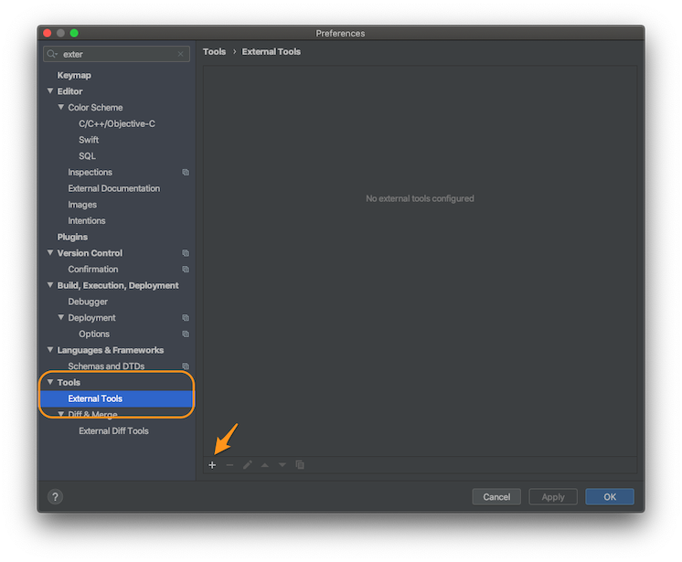
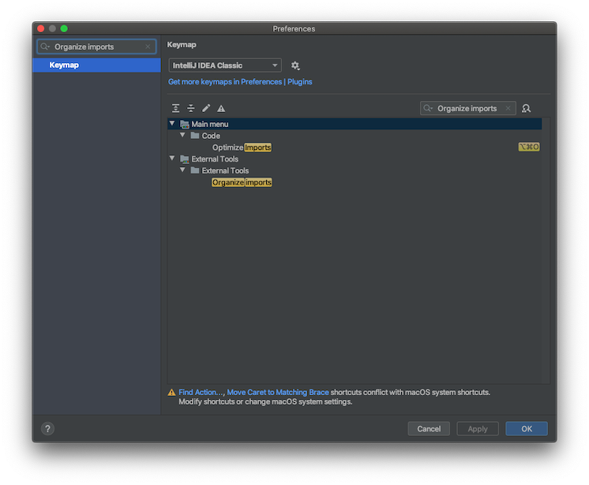

    

# Organize Imports
Simple Swift script to alphabetically organize imports in your project's files.
It's created with [Marathon](https://github.com/JohnSundell/Marathon) command line tool.

## Installation

First of all install [Marathon](https://github.com/JohnSundell/Marathon). Pay attention to Marathon [requirements](https://github.com/JohnSundell/Marathon#requirements). 
You can run script with `marathon run` command, but I highly recommend installation to use it everywhere.

To install script as binary try: 
`$ marathon install organize_imports.swift` 

or 
`$ marathon install https://raw.githubusercontent.com/swziy/OrganizeImports/master/organize_imports.swift` 

## Usage

You can run it on a directory: 
`$ organize_imports -dir myProject/Classes` 

or on a single file: 
`$ organize_imports -file myProject/Classes/MyFantasticClass.swift` 

## Integration

If you're using AppCode, there is an option to integrate script as an external tool and run it with a shortcut directly from IDE. Check configuration screens below. 

1. Find `External Tools` section in AppCode and click `+` button. 

2. Copy this configuration. 
Program: `/usr/local/bin/organize_imports` 
Parameters: `-file $FilePath$` 
Working directory: `/usr/local/bin/` 

3. Assign shortcut of your choice. 
  

### License

MIT license. See the [LICENSE file](LICENSE.txt) for details.
