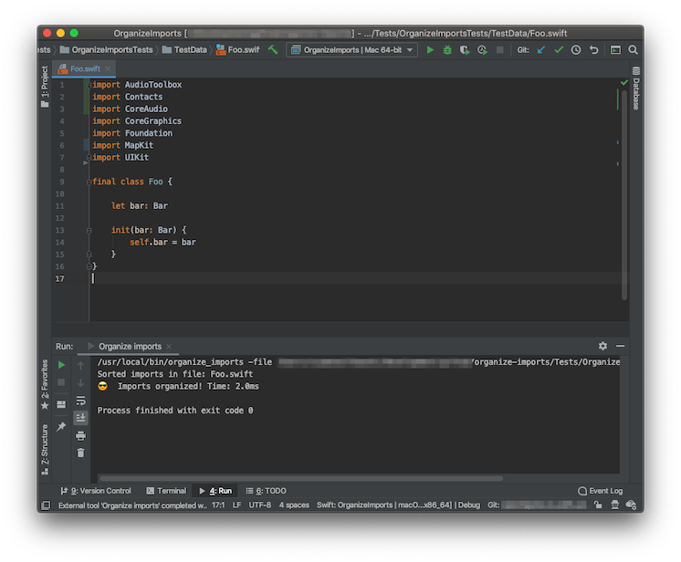

    

# Organize Imports
Simple Swift script to alphabetically organize imports in your project's files.
It's created with [Marathon](https://github.com/JohnSundell/Marathon) command line tool.

## Installation

1. Clone repository and enter main folder
2. Fallow this steps: 
  `$ swift build -c release` 
  `$ cd .build/release` 
  `$ cp -f OrganizeImports /usr/local/bin/organize_imports` 

## Usage

You can run it on a directory: 
`$ organize_imports -dir myProject/Classes` 

or on a single file: 
`$ organize_imports -file myProject/Classes/MyFantasticClass.swift` 

## Integration

If you're using AppCode, there is an option to integrate script as an external tool and run it with a shortcut directly from IDE. Check configuration screens below. 

1. Find `External Tools` section in AppCode and click `+` button. 

2. Copy this configuration. 
Program: `/usr/local/bin/organize_imports` 
Parameters: `-file $FilePath$` 
Working directory: `$FileDir` 

3. Assign shortcut of your choice. 

4. Try sorting imports with shortcut. 

### License

MIT license. See the [LICENSE file](LICENSE.txt) for details.
